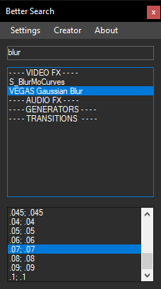

# Better Search

Improved search for Effects, Generators, and their Presets.

## Video

https://www.youtube.com/watch?v=eJtW4jLYJ8I

## Overview

Quickly search and find **VideoFX**, **AudioFX** and **Generators**

**Add or Remove** from your **Favorite list** by **right clicking** on an **item**

Toggle options in the **Settings** menu such as:

- **Only Show Favorites**

## How to use

Make sure you have .NET 4.8 (or higher) installed.

1. Download "...13" for `13 and below`, or "...14" for `14 and above` Vegas Pro versions
2. Find or create a folder called Vegas Script Menu inside your **This PC - My Documents** folder like this:
   - `[user_name]\Documents\Vegas Application Extensions`
   - on Windows 11 try the following: `[user_name]\OneDrive\Documents\Vegas Application Extensions` 
3. Extract the contents of the .zip file into the folder above
4. Start VEGAS Pro and you can find the Script at `View - Extensions`

## Build

Import the correct reference:

Project -> Add reference -> Browse -> Your VEGAS install folder ->

- `ScriptPortal.Vegas.dll` for SONY Vegas Pro 13 and below

- `Sony.Vegas.dll` for MAGIX Vegas Pro 14 and above
